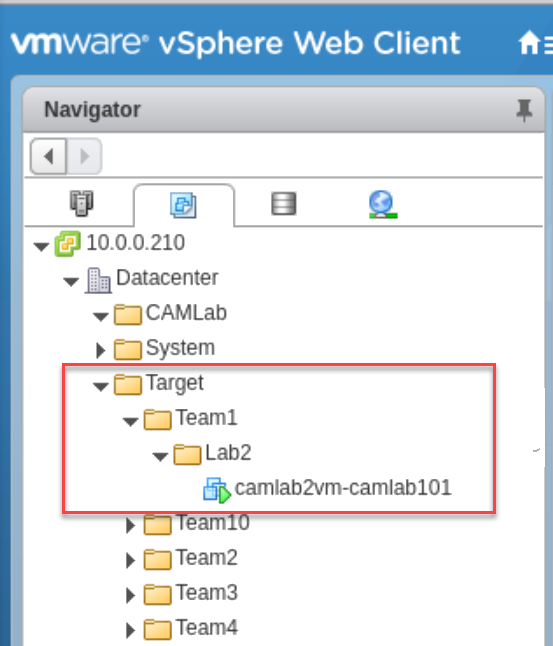
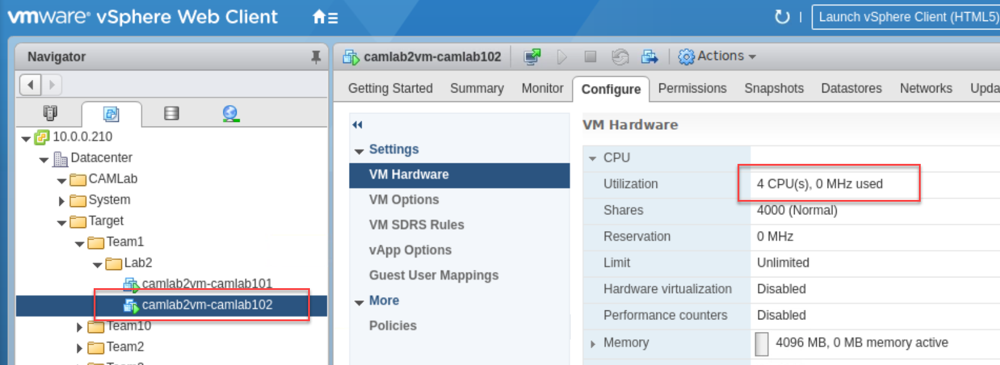
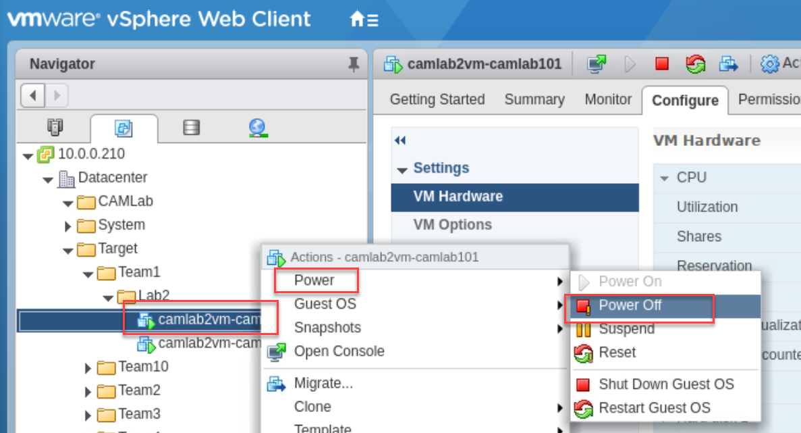
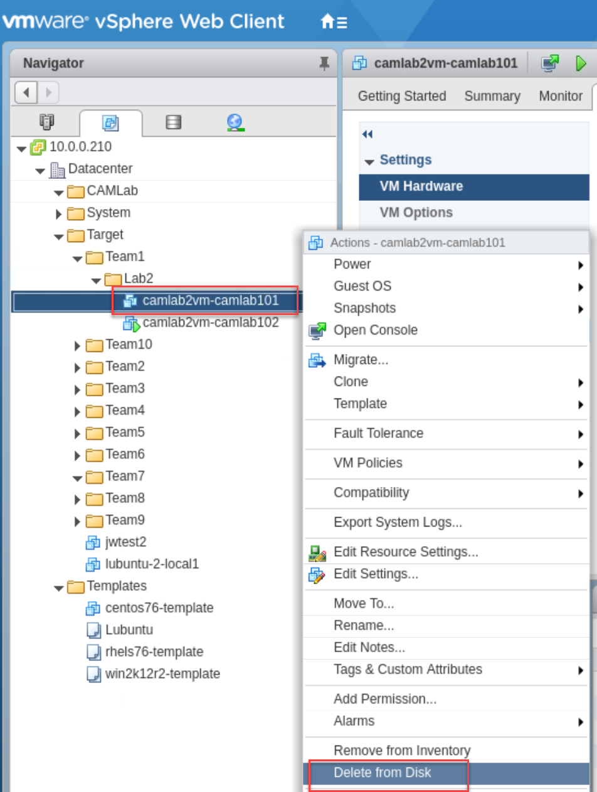

# Terraform Simple Deployment Install

# Readying your environment

In this section we will identify the location of the Terraform Simple Deployment Lab files and initialize the working directory. 

Execute this section from the **Boot** node.

<!--login directory may change. Update the path once we know where it will reside. Need to know if this has to be pulled down as part of this lab -->

1. Launch the terminal emulator that can be found on the desktop

2. Create a new folder for the terraform files and clone the Lab repository. Then remove the .git folder to stop any changes being made to the original by mistake (effectively disconnecting your clone from Git)

   ```
   mkdir Terraform
   cd Terraforrm
   git clone https://github.com/jdiggity22/CAMLabs.git
   rm -rf ~/Terraform/CAMLabs/.git
   ```

3. Change to the terraform working directory

   ```
   cd ~/Terraform/CAMLabs/Terraform/Lab2
   ```

4. Initialize this terraform working directory. 

   This will ensure, amongst other things, that the required provider plugins are installed.	

   Note: This is the first command that should be run after writing a new Terraform configuration or cloning an existing one from version control. It is safe to run this command multiple times.

   ```
   terrform init
   ```

5. Set the vCenter access credentials

   Note: As a best practice, it is recommended to NOT include credentials, especially passwords inside configuration files and / or scripts.

   ```
   export VSPHERE_USER=Administrator@VSPHERE.LOCAL
   export VSPHERE_PASSWORD=Passw0rd!
   ```

## Create your first instance

In this section we will create a RedHat 76 Linux virtual machine in vCenter. 

First, launch the vSphere Web Client via the Chrome web browser (connection tab is already defined). Login with the same credentials used above in step 3.

This will give you the chance to see the virtual machine as it is deployed.


Now, run the validation plan. This will validate that the terraform configurations are correct and indicate what it would do if applied.

```
terraform plan
```

Note: This terraform plan will prompt for a 'Student ID'. Please use the number you have been allocated.

Now it is time to execute (apply) the plan. This will produce the same output that was seen during the previous command but will then prompt you to approve the changes. Please enter 'yes'.

```
terraform apply
```

On completion, a summary indicating the number of resources that have been affected is listed. This should indicate that 3 were added, 0 changed and 0 deleted.

If you now look at your previously launched vSphere Web Client, you should now see (under the VMs and Templates tab) a new virtual machine has been created similar to the one below. 



Note: Your VM will be created in a folder under Datacenter -> Target -> TeamX -> Lab2 where 'X' is your team ID.

### Re-running the plan

What do you expect to happen ?

Run the following command and pay attention to the change summary.

1. ```
   terraform apply
   ```

If you guessed 'nothing', you are correct !!! 

Because the plan matches what is actual provisioned, there is nothing for it to do.

### Increasing the number of virtual machines (nodes) this plan requires

Now we have a functional plan, what if we want to have an additional virtual machine.

Follow these steps to increase the number of desired virtual machines to '2'.

1. Edit the **terraform.tfvars** file using

   ```
   vi terraform.tfvars
   ```

2. Search for the line which has **nodes = "1"** and change the '1' to '2'. Save the changes using **:wq!**

3. Re-run the plan using the following command (make sure you use the same student ID)

   ```
   terraform apply 
   ```

This time you should notice that the plan activity will be to 'add' 1 new virtual machine. Approve the plan by typing 'yes'.

On completion of the plan you should now see a second virtual machine via the vSphere browser in the same folder as the original one.

### Changing the virtual machines (nodes) resources

Now we are going to change the desired resources of the virtual machines we have already created.

1. Again, edit the **terraform.tfvars** file using

   ```
   vi terraform.tfvars
   ```

2. Locate the line which has **vcpu = "2"**. Change the '2' to '4' and save the changes using **:wq!**

3. Re-run the plan using the following command (make sure you use the same student ID)

   ```
   terraform apply 
   ```

This time the plan should indicate that it will make 2 changes and describe what those changes will be, namely changing the number of CPUs from 2 to 4. Type 'yes' to approve the changes.

On completion, look at your virtual machines resources via the vSphere Web Client. Right click on one of them and choose 'Edit settings'. This should bring up a screen similar to this and you will see that the number of CPUs is now 4.



Click on 'Cancel' to close the Edit Settings popup.

### Deleing a virtual machine (node) via vSphere Web Client

We are now going to remove a virtual machine using the vSphere Web Client. 

Because you can't delete a running virtual machine via vSphere Web Client, we first need to power it off.

To do this, first identify either of the two virtual machines you previously create via the terraform plan and right click on it, choose **Power** and **Power Off**. This will shutdown the virtual machine.



Once powered off, right click on the virtual machine again and choose **Delete from disk** and confirm the removal.



Now you should only have a single virtual machine in your vSphere folder.

Now when we run the terraform plan, it will determine what the current (real) state is and make the changes to bring it back inline with the plan.

Run the plan again from the command line.

```
terraform apply
```

You should notice that it will now re-add the virtual machine back. 

On completion, check vSphere Web Client to make sure you once again have two virtual machines.

### Destroying a plan

To remove everything in a plan. In our example the two virtual machines, run the following ...

```
terraform destroy
```

Confirm the plan has been removed by making sure the virtual machines and the folder they resided in (Lab2), no longer exist in vSphere.
