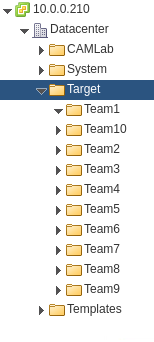

# Team Assignments

This document will describe how the student teams will interact with the system.

| Name    | IP Range         | Owner |
| ------- | ---------------- | ----- |
| Team 1  | 10.0.0.[110-119] |       |
| Team 2  | 10.0.0.[120-129] |       |
| Team 3  | 10.0.0.[130-139] |       |
| Team 4  | 10.0.0.[140-149] |       |
| Team 5  | 10.0.0.[150-159] |       |
| Team 6  | 10.0.0.[160-169] |       |
| Team 7  | 10.0.0.[170-179] |       |
| Team 8  | 10.0.0.[180-189] |       |
| Team 9  | 10.0.0.[190-199] |       |
| Team 10 | 10.0.0.[200-209] |       |

**VMware Folders**

Folders have been created in VMware for each Team. Please provision all instances into your VMware folder.

